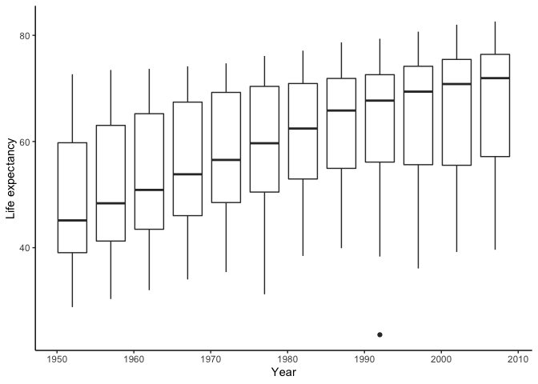

An exploration of the gapminder dataset
================

``` r
library(gapminder)
library(ggplot2)
```

## A summary of the dataset

``` r
summary(gapminder)
```

    ##         country        continent        year         lifeExp     
    ##  Afghanistan:  12   Africa  :624   Min.   :1952   Min.   :23.60  
    ##  Albania    :  12   Americas:300   1st Qu.:1966   1st Qu.:48.20  
    ##  Algeria    :  12   Asia    :396   Median :1980   Median :60.71  
    ##  Angola     :  12   Europe  :360   Mean   :1980   Mean   :59.47  
    ##  Argentina  :  12   Oceania : 24   3rd Qu.:1993   3rd Qu.:70.85  
    ##  Australia  :  12                  Max.   :2007   Max.   :82.60  
    ##  (Other)    :1632                                                
    ##       pop              gdpPercap       
    ##  Min.   :6.001e+04   Min.   :   241.2  
    ##  1st Qu.:2.794e+06   1st Qu.:  1202.1  
    ##  Median :7.024e+06   Median :  3531.8  
    ##  Mean   :2.960e+07   Mean   :  7215.3  
    ##  3rd Qu.:1.959e+07   3rd Qu.:  9325.5  
    ##  Max.   :1.319e+09   Max.   :113523.1  
    ## 

``` r
nrow(gapminder)
```

    ## [1] 1704

``` r
range(gapminder$lifeExp)
```

    ## [1] 23.599 82.603

``` r
mean(gapminder$lifeExp)
```

    ## [1] 59.47444

## A boxplot of life expectancy by year

``` r
ggplot(gapminder, aes(year, lifeExp, group = year))+
  geom_boxplot()+
  labs(x ="Year", y ="Life expectancy")+
  theme_classic()
```

<!-- -->
