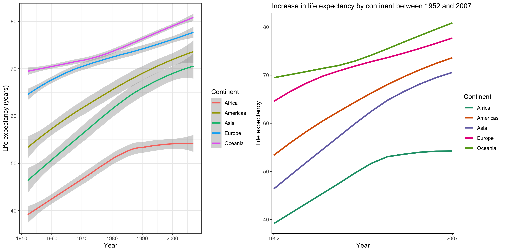

# Assignment 5: Factor and figure management
```{r setup, include=FALSE}
knitr::opts_chunk$set(echo = TRUE)
```

```{r}
library(gapminder)
library(tidyverse)
library(dplyr)
library(forcats)
library(ggplot2)
library(dplyr)
library(here)
```


## EX.1 The value of the here::here package
The main value of the here::here package is in its ability to allow reproducability across multiple platforms and users. Here() creates a platform independent path, meaning it works for both Mac and Windows. In contrast, when writing paths yourself, it will most likely differ between operating systems, creating issues for code and data sharing. Additionally, here makes your code more robust when taking it outside of the project you are working in, and allows you to save output to different sub-directories, without changing the relative directory. It allows you to open and run any files outside of an Rstudio project which again is especially useful when there are multiple collaborators, potentially using different platforms and interfaces. 

## EX.2 Factor management
Dataframe chosen: gapminder

### 1. Drop Oceania
From this analysis we see that in the original data set there are 5 continents (nlevels() function) and 1704 rows of data (nrow() function). However once we filter out Oceania and drop unused levels (droplevels() function), there are now only 4 continents and 1680 rows of data.
```{r}
gapminder$continent %>% 
  nlevels()

gapminder %>%
  nrow()

gapminder.2 <- gapminder %>%
  filter(continent != "Oceania") %>%
  droplevels()

gapminder.2$continent %>%
  nlevels()

gapminder.2%>%
  nrow()
```


### 2. Reorder levels
Here I find the maximum GDP per capita for each continent and then plot the data, reordering it so that instead of sorting by the default alphabetical, it is sorting it from the minimum to maximum values of GDP. We can see here that Asia has the maximum GDP per capita out of all the continents. 
```{r}
gapminder %>% 
  select(continent, gdpPercap) %>%
  group_by(continent) %>%
  summarise(maxGDP = max(gdpPercap)) %>%
  ggplot() +
  geom_col(aes(fct_reorder(continent, maxGDP, min), maxGDP, fill = continent))+
  xlab("Continent") +
  ggtitle("Maximum GDP per capita in each continent") +
  scale_y_continuous("GDP per capita", labels = scales::dollar_format()) +
  theme_bw() +
  theme(legend.position = "none")
  

```


## EX.3 File input/output
Here I create a new data set, which is the GDP per capita for all countries in Europe in 2007. I export it to disk as a .csv, using here::here to specify the path.
Then I import the data back in and name it 'EuropeGDP'. With this new data frame I plot it, reordering the levels so that axis starts with the minimum value for GDP per capita. 
write_csv and read_csv worked for this exercise, with the data looking exactly the same between importing and exporting it, i.e. countries were arranged in the data frame alphabetically.

```{r}
(New_data <- gapminder %>%
  filter(continent == "Europe",
         year == "2007") %>%
   select(country, gdpPercap) %>%
  group_by(country))%>%
  DT::datatable()

write_csv(New_data, here::here("hw05", "Data", "EuropeGDP.csv"))

(EuropeGDP<- read_csv(here::here("hw05", "Data", "EuropeGDP.csv")))


EuropeGDP %>%
  ggplot() +
  geom_col(aes(fct_reorder(country, gdpPercap, min), gdpPercap))+
  coord_flip()+
  scale_y_continuous("GDP per capita", labels = scales::dollar_format()) +
  xlab("") +
  ggtitle("GDP per capita for European countries in 2007") +
  theme_bw()
```


## EX.4 Visualisation design
For this exercise I have chosen a figure I created in the 3rd week of class. It was trying to show the increase in life expectancy over time between the continents. I have redone this figure to improve it aesthetically, as well as hopefully make interpretation of the data easier. This mostly included adding a title, removing some gridlines and changing colours so that they are colourblind friendly. The figure below allows side by side comparison of the two graphs with the one from hw03 (left) and then one for hw05 (right).
```{r, fig.width=12, fig.height=6}

fig1 <- ggplot(gapminder, aes(year,lifeExp, group=continent)) + 
  geom_smooth(aes(colour=continent)) + 
  labs(x = "Year", y = "Life expectancy (years)", colour = "Continent")+
  theme_bw()

fig2 <- ggplot(gapminder, aes(year,lifeExp, group=continent)) + 
  geom_smooth(aes(colour=continent), size = 1.2, se = FALSE) + 
  labs(x = "Year", y = "Life expectancy", colour = "Continent")+
  scale_color_brewer(palette = "Dark2")+
  scale_x_discrete(limits = c(1952, 2007))+
  ggtitle("Increase in life expectancy by continent between 1952 and 2007")+
  theme_bw()+
  theme(plot.title =element_text(size=12),
        panel.border = element_blank(),
        panel.grid = element_blank(),
        axis.line = element_line(colour = "black"))

(Figure.complete<- gridExtra::grid.arrange(fig1, fig2, nrow = 1))
```
 


## EX.5 Writing figures to file
Here I use the ggsave() function to save the side by side plot to my directory. I have specified the height as well as dpi to ensure image quality is retained. The left figure is the graph I made in week 3 and the right hand one I made for this assignment
```{r}
ggsave("Final_figure.png", Figure.complete, width = 12, height = 6, dpi = 300)
```



